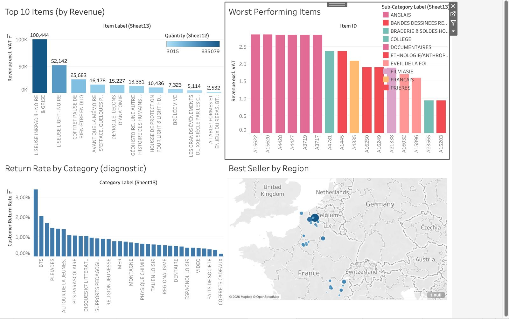
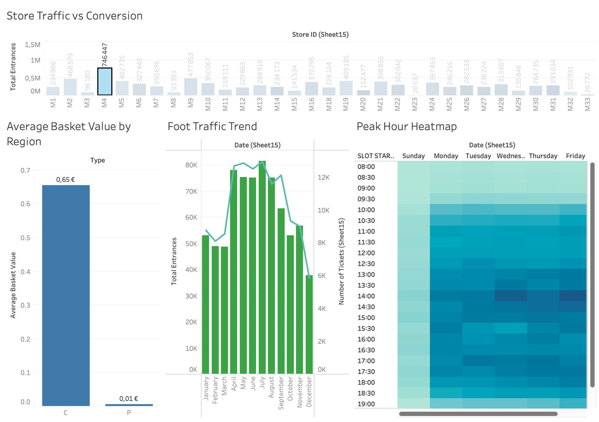
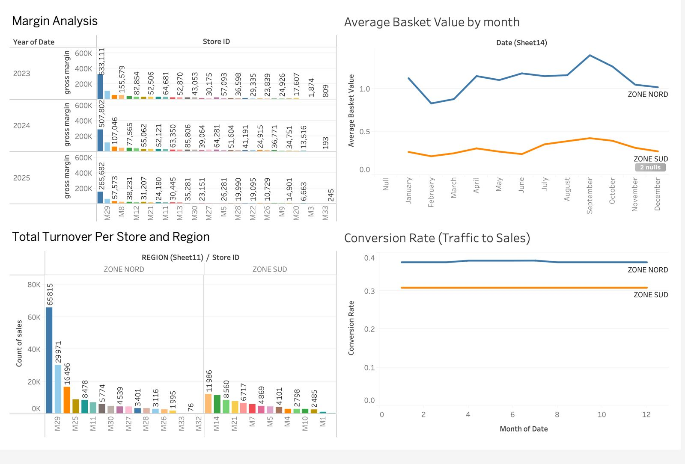

# Bookstore Business Intelligence Dashboard

## Overview
This project analyzes bookstore sales and foot traffic data using Tableau to generate business insights and support data-driven decision-making.

The dashboard focuses on sales performance, category contribution, bestseller trends, and customer traffic patterns.

---

## Business Questions
- Which product categories generate the most revenue?
- Which products are bestsellers or underperforming?
- How does foot traffic impact sales?
- What trends can be observed over time?

---

## Tools Used
- Tableau
- Excel
- Data Visualization
- KPI Analysis

---

## Dashboard Features
- Sales performance dashboard
- Foot traffic analysis
- Category contribution analysis
- Bestseller trend tracking
- Revenue trend visualization

---

## Key Insights
- Store M29 consistently generated the highest revenue and gross margin, significantly outperforming other locations.
- Northern region stores achieved both higher conversion rates and higher average basket values than southern region stores.
- Foot traffic and transaction activity peaked between spring and early autumn, with strongest customer activity occurring during midday hours.
- A small number of products contributed disproportionately to total revenue, revealing strong bestseller concentration.
- Several categories showed elevated return rates, suggesting opportunities to improve product quality or customer targeting.
- Certain stores attracted high traffic but relatively lower conversion, indicating potential operational or merchandising inefficiencies.

---

## Sample Visualizations

---

## Files
- Tableau workbook (.twbx)
- Dashboard screenshots

---

## Learning Outcome
This project strengthened my skills in business intelligence, dashboard design, KPI visualization, and transforming raw data into actionable business insights.
